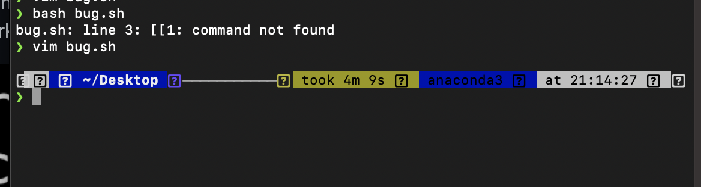
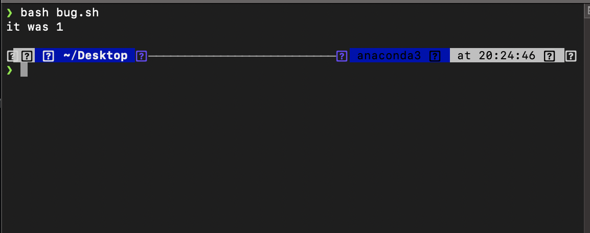

# Scenario 3


# 1.Original Post
What environment are you using (computer, operating system, web browser, terminal/editor, and so on)?
I am using MacOs.


Detail the symptom you're seeing. Be specific; include both what you're seeing and what you expected to see instead. Screenshots are great, copy-pasted terminal output is also great. Avoid saying “it doesn't work”.


Detail the failure-inducing input and context. That might mean any or all of the command you're running, a test case, command-line arguments, working directory, even the last few commands you ran. Do your best to provide as much context as you can.

bug.sh contains the following code:
```
VAR=7

if [[1 -eq $VAR ]]
then
  echo "it was 1"
fi
```

# 2.A response from a TA asking a leading question or suggesting a command to try (To be clear, you are mimicking a TA here.)
Good morning. It is a wonderful question. 
The reason is you are using the wrong syntax.
When you are trying to do if else condition, you have write like this.

```
VAR=7

if [[ condition ]]
then

fi
```
There are space infront and behind the condition. As for you current code, there won't be any output because 7 is not equal to 1.

# 3.Another screenshot/terminal output showing what information the student got from trying that, and a clear description of what the bug is.

The bug is cuased by if [[1 -eq $VAR ]].
The student needs to add a space before 1.


# 4.At the end, all the information needed about the setup including:


The file & directory structure needed
File is the bash script named bug.sh.
The directory is my desktop directory.
/Users/y/Desktop

The contents of each file before fixing the bug
bug.sh
```
VAR=7

if [[1 -eq $VAR ]]
then
  echo "it was 1"
fi
```

The full command line (or lines) you ran to trigger the bug
bash bug.sh
bug.sh: line 3: [[1: command not found

A description of what to edit to fix the bug
Adding a space before 1.
If you want to print out "it was 1", you need to change VAR to 1.


# reflection
One thing I learned is how to write script.
I could automatically process many of my python code using conditions.
For example, I could ran certain command line every hour, which is super useful.

